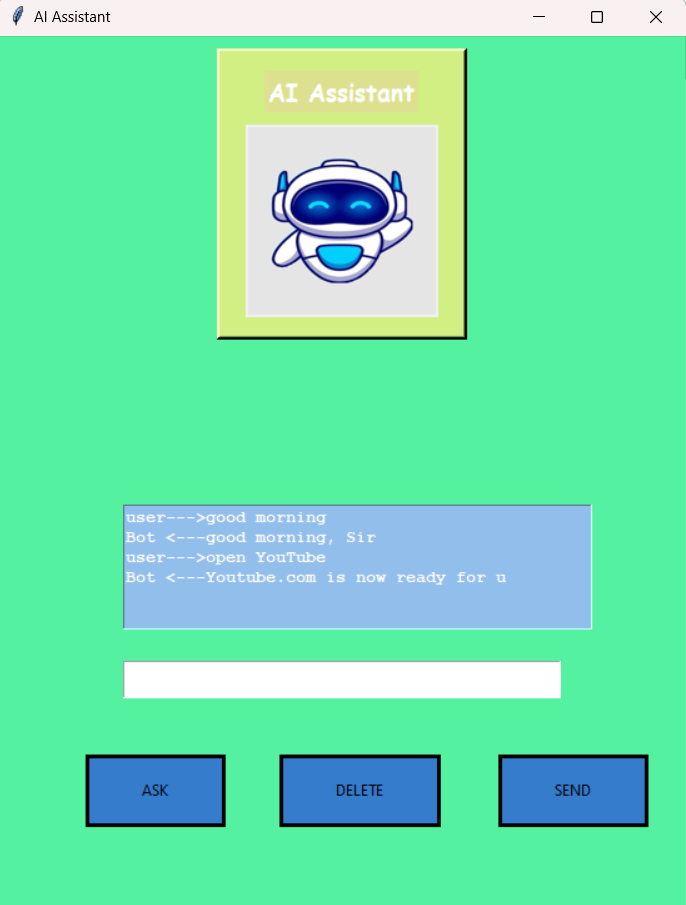

# AI-Voice-Assistant
A voice-activated AI assistant with GUI using Python, speech recognition, and web integration.
# 🧠 AI Voice Assistant

A Python-based voice-activated virtual assistant with a graphical user interface (GUI). It can respond to voice or text input and perform actions such as reporting the weather, opening websites, greeting the user, and telling the time — all using speech synthesis.

---

## 💡 Features

- 🎙️ **Speech Recognition** (via microphone input)
- 🗣️ **Text-to-Speech** responses
- 🌦️ **Weather updates** (via Google scraping)
- 🌐 **Open websites** like Google, YouTube, Gaana
- ⏰ **Tells current time**
- 👋 Greets user and responds to basic inputs
- 🖼️ Simple GUI built with **Tkinter**
- 📸 Includes an image/logo display

---

## 🛠️ Technologies Used

- `Python 3`
- `Tkinter` – GUI interface
- `SpeechRecognition` – speech-to-text
- `pyttsx3` – text-to-speech
- `requests-html` – web scraping (for weather)
- `Pillow` – image display in GUI

---

## 🚀 How to Run

1. **Clone this repo:**

```bash
git clone https://github.com/yourusername/AI-Voice-Assistant.git
cd AI-Voice-Assistant


📁 File Structure
    AI-Voice-Assistant/
    ├── actio.py              # Handles voice commands and logic
    ├── gui.py                # Main GUI interface
    ├── speech_to_text.py     # Microphone input to text
    ├── text_to_speech.py     # Text response to voice
    ├── weather.py            # Scrapes weather info
    ├── download (1).jpg      # Image used in the GUI
    ├── requirements.txt      # Required packages
    └── README.md             # This file

📝 Sample Commands
1."What is your name?"

2."Good morning"

3."What is the time now?"

4."Play music"

5."Open Google"

6."What's the weather?"


📸 Screenshot
Here is a preview of the AI Assistant GUI:



## 📄 License

This project is open-source and available under the [MIT License](LICENSE).

---

## 🙋‍♂️ Author

[**Aditya Chaubey**](https://github.com/aditya22721)

