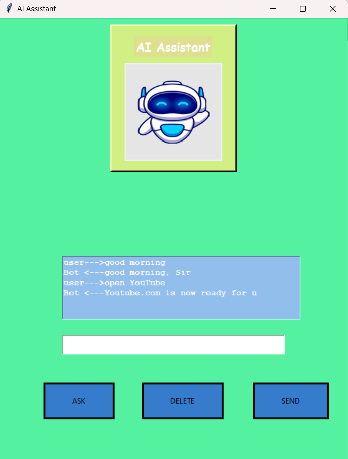

# AI-Voice-Assistant
A voice-activated AI assistant with GUI using Python, speech recognition, and web integration.
# 🧠 AI Voice Assistant

A Python-based voice-activated virtual assistant with a graphical user interface (GUI). It responds to voice or text input and performs tasks like telling jokes, sharing facts, fetching knowledge from Wikipedia, reporting the weather, opening websites, and more—all using speech synthesis.

---

## 💡 Features

Features
- 🎙️ Voice input using microphone
- 🗣️ Text-to-speech responses
- 🌦️ Weather updates
- 🌐 Opens websites like Google, YouTube, Gaana
- ⏰ Tells current time
- 🧠 Answers general knowledge questions via Wikipedia
- 😂 Tells programming jokes using pyjokes
- 📚 Shares fun facts
- 💬 Greets user and responds to basic inputs
- 🖼️ GUI built with Tkinter and image display using Pillow

🛠️ Technologies Used
- Python 3
- Tkinter – GUI interface
- SpeechRecognition – speech-to-text
- pyttsx3 – text-to-speech
- pyjokes – for jokes
- wikipedia – for knowledge queries
- requests-html – for weather scraping
- Pillow – image handling in GUI

🚀 How to Run
git clone https://github.com/aditya22721/AI-Voice-Assistant.git
cd AI-Voice-Assistant
pip install -r requirements.txt
python gui.py

📁 File Structure
AI-Voice-Assistant/
├── action.py             # Handles voice commands and logic
├── gui.py                # Main GUI interface
├── knowledge.py          # Jokes, facts, and Wikipedia queries
├── speech_to_text.py     # Converts microphone input to text
├── text_to_speech.py     # Converts text to speech
├── weather.py            # Scrapes weather info
├── download (1).jpg      # Image used in the GUI
├── requirements.txt      # Required packages
└── README.md             # This file

🧪 Sample Commands
- "What is your name?"
- "Tell me a joke"
- "Tell me a fact"
- "What is Python?"
- "Open Google"
- "What's the weather?"
- "Play music"
- "Good morning"

📸 Screenshot
Here is a preview of the AI Assistant GUI:

## 📄 License

This project is open-source and available under the [MIT License](LICENSE).

---

## 🙋‍♂️ Author

[**Aditya Chaubey**](https://github.com/aditya22721)

